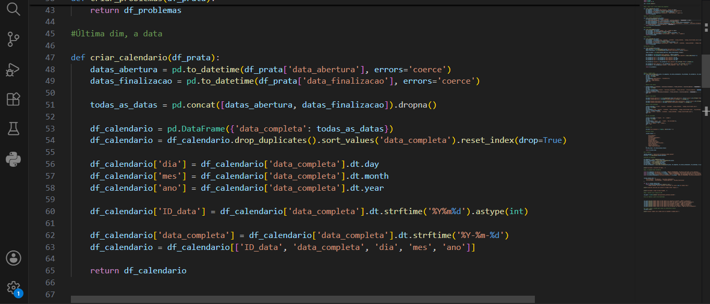
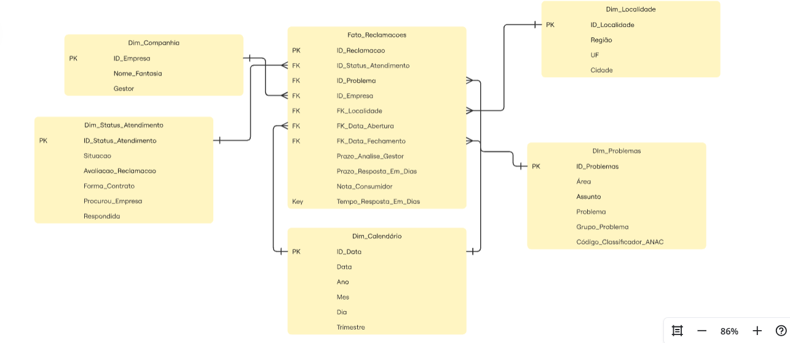
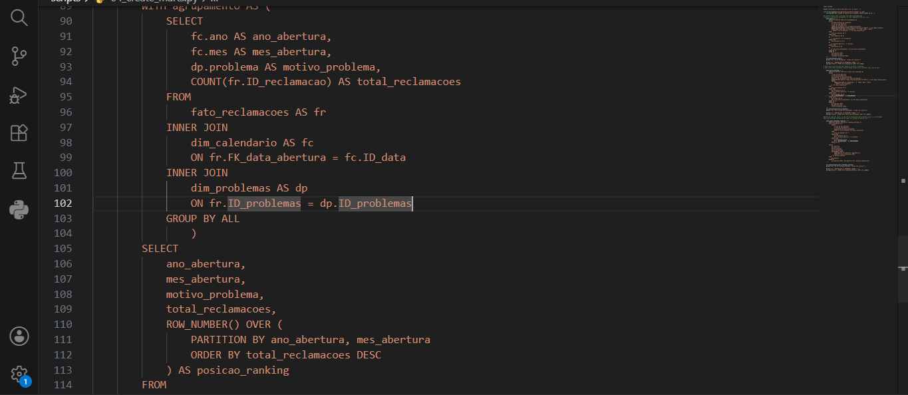
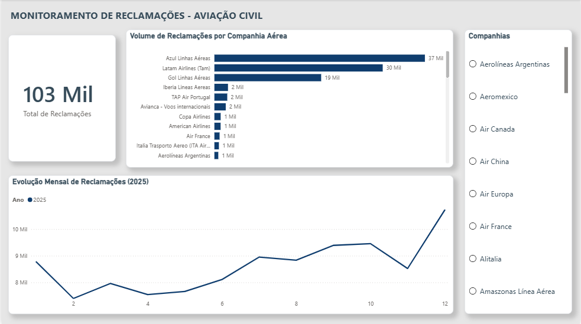
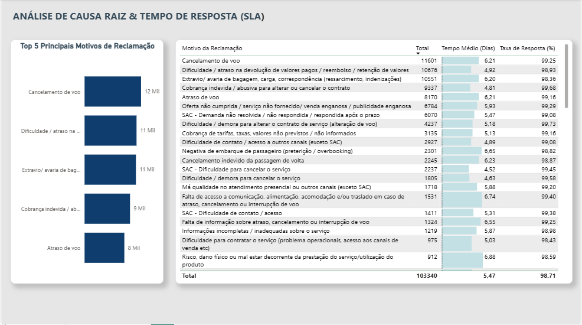

#  End-to-End Data Pipeline & Executive Analytics: Aviação Civil Brasileira (SAC / ANAC)

Análise analítica completa de mais de **100 mil reclamações de passageiros**, abordando todo o ciclo de vida do dado — da ingestão e modelagem de um Data Warehouse local até a camada visual para suporte a decisões de negócio (Business Intelligence).

---

##  1. Visão de Negócio & Motivação (A Experiência no SAC)

Ter atuado na linha de frente do **SAC (Serviço de Atendimento ao Consumidor)** me ensinou que por trás de cada protocolo aberto existe uma falha de processo e um cliente insatisfeito. 

Este projeto nasceu do desejo de unir meu entendimento operacional de Customer Experience com **Engenharia e Análise de Dados**. O objetivo não é apenas gerar um gráfico, mas responder perguntas fundamentais para um gestor operacional:
* Quais são os verdadeiros **gargalos (Causa Raiz)** que geram insatisfação no setor aéreo?
* Qual é a nossa eficiência operacional em **Tempo Médio de Resposta (SLA)**?
* Como podemos cruzar dados massivos de atendimento para otimizar processos internos?

---

##  2. Arquitetura de Dados & Medallion Design

Para garantir integridade, escalabilidade e separação de responsabilidades, o projeto foi construído seguindo a arquitetura **Medallion (Bronze, Silver, Gold)**:

1. **Camada Bronze:** Ingestão dos dados históricos e públicos da ANAC mantendo a fidelidade estrutural dos arquivos de origem.
2. **Camada Silver (Transformation & Cleaning):**
   * Processamento dos dados com Python e Pandas, incluindo padronização de tipos, tratamento de valores ausentes, remoção de duplicidades e preparação das tabelas para análise.
   * Padronização de datas, remoção de duplicidades e tratamento de strings.
   * Criação e modelagem de tabelas utilizando o **DuckDB** como motor OLAP local.
3. **Camada Gold (Business Marts via SQL):**
   * Modelagem de **Views Analíticas** focadas nas perguntas de negócio do dashboard.
   * Separação em três marts principais:
     * `desempenho`: Agregações de volume temporal e total por companhia aérea.
     * `ranking_problemas`: Uso de funções analíticas (`ROW_NUMBER()`) para cálculo de ranking dinâmico de insatisfação.
     * `causa_raiz_problemas`: Indicadores consolidados de SLA (`tempo_resposta_dias`) e taxa de resolução (`taxa_resposta_pct`).

---

##  3. Stack Tecnológico & Soluções de Engenharia

* **Linguagem & Ingestão:** Python (Pandas)
* **Data Warehouse (Local OLAP):** DuckDB
* **Manipulação & Modelagem Analítica:** SQL (Window Functions, CTEs, Agregações avançadas)
* **Business Intelligence & Viz:** Power BI (Formatação Condicional, Filtros Top N, UX/UI orientado a relatórios executivos)

---

## Código & Modelagem

### A. Criação dos DataFrames e Processamento em Python
*Manipulação inicial dos dados, limpeza e transformações escaláveis utilizando Pandas.*  

### B. Modelagem de Dados & Arquitetura
*Estruturação do banco OLAP para conexões performáticas entre as tabelas da camada Silver e Gold.*  

### C. SQL Analytics & Construção dos Data Marts (Gold)
*Códigos SQL estruturando regras de negócio, KPIs operacionais e funções de particionamento/ranking.*  

---

##  4. Dashboard Executivo & Insights (Power BI)

A interface no Power BI foi desenvolvida com foco no **princípio da baixa carga cognitiva**, eliminando ruídos visuais, ajustando contrastes de fundo e usando a formatação condicional como ponto de atenção.

### Página 1: Monitoramento & Visão Geral (SLA / Operações)
* **Visão Macro:** KPI totalizador de volume de reclamações (`103 Mil+` atendimentos processados).
* **Análise de Tendência:** Evolução mensal para identificar sazonalidades (como picos nos meses de alta temporada e férias).
* **Volume por Companhia:** Segmentação executiva para comparar em qual player do setor aéreo concentra-se o maior fluxo operacional.

### Página 2: Análise de Causa Raiz & Eficiência de Resposta
* **Pódio de Atendimento (Top 5):** Filtro `Top N` isolando as maiores dores operacionais da Aviação Civil (como *Cancelamento de voo*, *Dificuldade em canais SAC* e *Extravio de bagagem*).
* **Matriz de SLA (Formatação Condicional):** Tabela executiva organizada em ordem de relevância, com barras de dados visuais destacando os motivos em que a aviação **mais demora para responder o consumidor** e seu respectivo % de resolução.
* **Leitura Gerencial:** O tempo médio geral da aviação analisada fica em torno de **~5,47 dias**, com um impressionante patamar de sucesso no primeiro contato superior a **98%**.

---
*Projeto desenvolvido por João Vitor Porphirio Dias.*